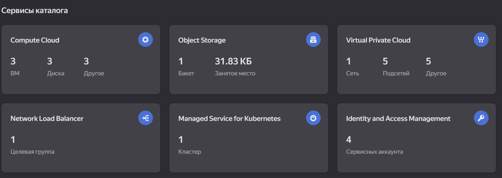
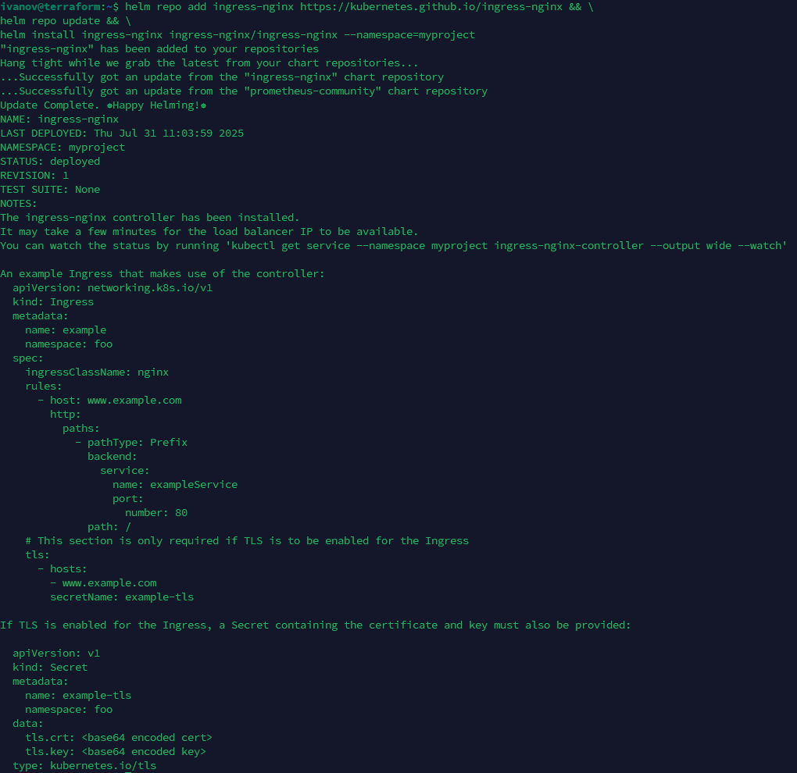

# Дипломный практикум в Yandex.Cloud
  * [Цели:](#цели)
  * [Этапы выполнения:](#этапы-выполнения)
     * [Создание облачной инфраструктуры](#создание-облачной-инфраструктуры)
     * [Создание Kubernetes кластера](#создание-kubernetes-кластера)
     * [Создание тестового приложения](#создание-тестового-приложения)
     * [Подготовка cистемы мониторинга и деплой приложения](#подготовка-cистемы-мониторинга-и-деплой-приложения)
     * [Установка и настройка CI/CD](#установка-и-настройка-cicd)
  * [Что необходимо для сдачи задания?](#что-необходимо-для-сдачи-задания)
  * [Как правильно задавать вопросы дипломному руководителю?](#как-правильно-задавать-вопросы-дипломному-руководителю)

**Перед началом работы над дипломным заданием изучите [Инструкция по экономии облачных ресурсов](https://github.com/netology-code/devops-materials/blob/master/cloudwork.MD).**

---
## Цели:

1. Подготовить облачную инфраструктуру на базе облачного провайдера Яндекс.Облако.
2. Запустить и сконфигурировать Kubernetes кластер.
3. Установить и настроить систему мониторинга.
4. Настроить и автоматизировать сборку тестового приложения с использованием Docker-контейнеров.
5. Настроить CI для автоматической сборки и тестирования.
6. Настроить CD для автоматического развёртывания приложения.

---
## Этапы выполнения:


### Создание облачной инфраструктуры

Структура проекта организована по каталогам:

    [1_bucket] (https://github.com/gaming4funNel/netology-diplom/tree/main/1_bucket) — отвечает за создание сервисной учетной записи и бакета в Yandex Cloud.

    [2_infrastructure] (https://github.com/gaming4funNel/netology-diplom/tree/main/2_infrastructure) — выполняет развёртывание инфраструктуры и поднятие кластера Kubernetes.

    [3_app] (https://github.com/gaming4funNel/netology-diplom/tree/main/3_app) — содержит код для деплоя приложения в кластер и настройки сущностей Ingress.

Для инициализации Terraform и автоматического применения конфигураций используется следующая последовательность команд:

```
terraform init
terraform apply
```

После создания бакета в папке 1_bucket, в каталог 2_infrastructure автоматически экспортируются файлы backend.auto.tfvars и personal.auto.tfvars, содержащие параметры для использования бакета в качестве backend хранилища состояния и для подключения к Yandex Cloud. Эти файлы включены в .gitignore для исключения из системы контроля версий.


Для развертывания инфраструктуры в папке 2_infrastructure выполняются команды:

```
terraform init -backend-config=backend.auto.tfvars
terraform apply
```





Файл состояния (terraform.tfstate) для инфраструктуры хранится в бакете Yandex Cloud, что позволяет организовать удалённое и централизованное управление.


<!-- Для начала необходимо подготовить облачную инфраструктуру в ЯО при помощи [Terraform](https://www.terraform.io/).

Особенности выполнения:

- Бюджет купона ограничен, что следует иметь в виду при проектировании инфраструктуры и использовании ресурсов;
Для облачного k8s используйте региональный мастер(неотказоустойчивый). Для self-hosted k8s минимизируйте ресурсы ВМ и долю ЦПУ. В обоих вариантах используйте прерываемые ВМ для worker nodes.

Предварительная подготовка к установке и запуску Kubernetes кластера.

1. Создайте сервисный аккаунт, который будет в дальнейшем использоваться Terraform для работы с инфраструктурой с необходимыми и достаточными правами. Не стоит использовать права суперпользователя
2. Подготовьте [backend](https://developer.hashicorp.com/terraform/language/backend) для Terraform:  
   а. Рекомендуемый вариант: S3 bucket в созданном ЯО аккаунте(создание бакета через TF)
   б. Альтернативный вариант:  [Terraform Cloud](https://app.terraform.io/)
3. Создайте конфигурацию Terrafrom, используя созданный бакет ранее как бекенд для хранения стейт файла. Конфигурации Terraform для создания сервисного аккаунта и бакета и основной инфраструктуры следует сохранить в разных папках.
4. Создайте VPC с подсетями в разных зонах доступности.
5. Убедитесь, что теперь вы можете выполнить команды `terraform destroy` и `terraform apply` без дополнительных ручных действий.
6. В случае использования [Terraform Cloud](https://app.terraform.io/) в качестве [backend](https://developer.hashicorp.com/terraform/language/backend) убедитесь, что применение изменений успешно проходит, используя web-интерфейс Terraform cloud.

Ожидаемые результаты:

1. Terraform сконфигурирован и создание инфраструктуры посредством Terraform возможно без дополнительных ручных действий, стейт основной конфигурации сохраняется в бакете или Terraform Cloud
2. Полученная конфигурация инфраструктуры является предварительной, поэтому в ходе дальнейшего выполнения задания возможны изменения. -->
---
### Создание Kubernetes кластера

Для развертывания Kubernetes кластера использовал готовое решение Yandex Managed Service for Kubernetes с мастером и группами нод.

Заранее создал резервную копию файла ~/.kube/config, так как планирую перезаписывать его напрямую через Terraform в пользовательскую директорию.


```
kubectl get pods --all-namespaces
```


<!-- На этом этапе необходимо создать [Kubernetes](https://kubernetes.io/ru/docs/concepts/overview/what-is-kubernetes/) кластер на базе предварительно созданной инфраструктуры.   Требуется обеспечить доступ к ресурсам из Интернета.

Это можно сделать двумя способами:

1. Рекомендуемый вариант: самостоятельная установка Kubernetes кластера.  
   а. При помощи Terraform подготовить как минимум 3 виртуальных машины Compute Cloud для создания Kubernetes-кластера. Тип виртуальной машины следует выбрать самостоятельно с учётом требовании к производительности и стоимости. Если в дальнейшем поймете, что необходимо сменить тип инстанса, используйте Terraform для внесения изменений.  
   б. Подготовить [ansible](https://www.ansible.com/) конфигурации, можно воспользоваться, например [Kubespray](https://kubernetes.io/docs/setup/production-environment/tools/kubespray/)  
   в. Задеплоить Kubernetes на подготовленные ранее инстансы, в случае нехватки каких-либо ресурсов вы всегда можете создать их при помощи Terraform.
2. Альтернативный вариант: воспользуйтесь сервисом [Yandex Managed Service for Kubernetes](https://cloud.yandex.ru/services/managed-kubernetes)  
  а. С помощью terraform resource для [kubernetes](https://registry.terraform.io/providers/yandex-cloud/yandex/latest/docs/resources/kubernetes_cluster) создать **региональный** мастер kubernetes с размещением нод в разных 3 подсетях      
  б. С помощью terraform resource для [kubernetes node group](https://registry.terraform.io/providers/yandex-cloud/yandex/latest/docs/resources/kubernetes_node_group)
  
Ожидаемый результат:

1. Работоспособный Kubernetes кластер.
2. В файле `~/.kube/config` находятся данные для доступа к кластеру.
3. Команда `kubectl get pods --all-namespaces` отрабатывает без ошибок. -->

---
### Создание тестового приложения

<!--Для перехода к следующему этапу необходимо подготовить тестовое приложение, эмулирующее основное приложение разрабатываемое вашей компанией.

Способ подготовки:

1. Рекомендуемый вариант:  
   а. Создайте отдельный git репозиторий с простым nginx конфигом, который будет отдавать статические данные.  
   б. Подготовьте Dockerfile для создания образа приложения.  
2. Альтернативный вариант:  
   а. Используйте любой другой код, главное, чтобы был самостоятельно создан Dockerfile.

Ожидаемый результат:

1. Git репозиторий с тестовым приложением и Dockerfile.
2. Регистри с собранным docker image. В качестве регистри может быть DockerHub или [Yandex Container Registry](https://cloud.yandex.ru/services/container-registry), созданный также с помощью terraform.-->

Создан контейнер nginx-app. Приложение представляет собой статический сайт на nginx, созданный из Dockerfile на основе nginx:alpine

Репозиторий приложения https://github.com/gaming4funNel/nginx-app


Залил образ в Dockerhub с тегом init https://hub.docker.com/r/gaming4funnel/nginx-app


Развернул локально для теста


---
### Подготовка cистемы мониторинга и деплой приложения

Создание неймспейса для проекта

```
kubectl create namespace myproject
```

Добавление мониторинга helm-чартом

```
helm repo add prometheus-community https://prometheus-community.github.io/helm-charts && \
helm repo update && \
helm install prometheus prometheus-community/kube-prometheus-stack --namespace=myproject
```


Helm-чарт для ингресса

```
helm repo add ingress-nginx https://kubernetes.github.io/ingress-nginx && \
helm repo update && \
helm install ingress-nginx ingress-nginx/ingress-nginx --namespace=myproject
```



Проверка установки


Деплой приложения из образа, деплой ингресса и создание сервисной учетки для CI/CD GitHub Actions

```
kubectl apply -f deploy.yml
kubectl apply -f ingress.yml
kubectl apply -f sa_for_github.yml
```


Зоны в DNS скорректированы на IP балансировщика


Проверка приложения


Проверка grafana


<!-- Уже должны быть готовы конфигурации для автоматического создания облачной инфраструктуры и поднятия Kubernetes кластера.  
Теперь необходимо подготовить конфигурационные файлы для настройки нашего Kubernetes кластера.

Цель:
1. Задеплоить в кластер [prometheus](https://prometheus.io/), [grafana](https://grafana.com/), [alertmanager](https://github.com/prometheus/alertmanager), [экспортер](https://github.com/prometheus/node_exporter) основных метрик Kubernetes.
2. Задеплоить тестовое приложение, например, [nginx](https://www.nginx.com/) сервер отдающий статическую страницу.

Способ выполнения:
1. Воспользоваться пакетом [kube-prometheus](https://github.com/prometheus-operator/kube-prometheus), который уже включает в себя [Kubernetes оператор](https://operatorhub.io/) для [grafana](https://grafana.com/), [prometheus](https://prometheus.io/), [alertmanager](https://github.com/prometheus/alertmanager) и [node_exporter](https://github.com/prometheus/node_exporter). Альтернативный вариант - использовать набор helm чартов от [bitnami](https://github.com/bitnami/charts/tree/main/bitnami).

### Деплой инфраструктуры в terraform pipeline -->

<!-- 1. Если на первом этапе вы не воспользовались [Terraform Cloud](https://app.terraform.io/), то задеплойте и настройте в кластере [atlantis](https://www.runatlantis.io/) для отслеживания изменений инфраструктуры. Альтернативный вариант 3 задания: вместо Terraform Cloud или atlantis настройте на автоматический запуск и применение конфигурации terraform из вашего git-репозитория в выбранной вами CI-CD системе при любом комите в main ветку. Предоставьте скриншоты работы пайплайна из CI/CD системы.

Ожидаемый результат:
1. Git репозиторий с конфигурационными файлами для настройки Kubernetes.
2. Http доступ на 80 порту к web интерфейсу grafana.
3. Дашборды в grafana отображающие состояние Kubernetes кластера.
4. Http доступ на 80 порту к тестовому приложению.
5. Atlantis или terraform cloud или ci/cd-terraform -->
---
### Установка и настройка CI/CD

Для автоматизации процессов разработки и развертывания буду использовать GitHub Actions. Поскольку репозитории дипломной работы размещены на GitHub, нет необходимости в развертывании отдельных контейнеров или виртуальных машин для CI/CD и воркеров, что позволяет значительно сократить расходы. 

Для обеспечения взаимодействия пайплайна с Kubernetes кластером потребуется создать конфигурационный файл для ранее созданного сервисного аккаунта и добавить его в секреты GitHub Actions. Также для работы пайплайна с репозиторием необходимо будет передать в секреты GitHub Actions учетные данные специально созданных токенов (DOCKERHUB_USERNAME и DOCKERHUB_TOKEN).


Workflow:

- при выполнении коммита в ветку main без указания тега, артефакт автоматически публикуется в DockerHub с тегом, сформированным по шаблону nightly-%d-%m-%Y-%H-%M-%S. Одновременно в индексном файле происходит замена строки BUILD на сгенерированный тег.


- при выполнении коммита в ветку main с указанием тега, артефакт автоматически отправляется в DockerHub с указанным тегом, в индексном файле происходит замена строки BUILD на соответствующий тег, а также выполняется развертывание образа в кластере Kubernetes.


<!-- Осталось настроить ci/cd систему для автоматической сборки docker image и деплоя приложения при изменении кода.

Цель:

1. Автоматическая сборка docker образа при коммите в репозиторий с тестовым приложением.
2. Автоматический деплой нового docker образа.

Можно использовать [teamcity](https://www.jetbrains.com/ru-ru/teamcity/), [jenkins](https://www.jenkins.io/), [GitLab CI](https://about.gitlab.com/stages-devops-lifecycle/continuous-integration/) или GitHub Actions.

Ожидаемый результат:

1. Интерфейс ci/cd сервиса доступен по http.
2. При любом коммите в репозиторие с тестовым приложением происходит сборка и отправка в регистр Docker образа.
3. При создании тега (например, v1.0.0) происходит сборка и отправка с соответствующим label в регистри, а также деплой соответствующего Docker образа в кластер Kubernetes.

---
## Что необходимо для сдачи задания? -->

<!-- 1. Репозиторий с конфигурационными файлами Terraform и готовность продемонстрировать создание всех ресурсов с нуля.
2. Пример pull request с комментариями созданными atlantis'ом или снимки экрана из Terraform Cloud или вашего CI-CD-terraform pipeline.
3. Репозиторий с конфигурацией ansible, если был выбран способ создания Kubernetes кластера при помощи ansible.
4. Репозиторий с Dockerfile тестового приложения и ссылка на собранный docker image.
5. Репозиторий с конфигурацией Kubernetes кластера.
6. Ссылка на тестовое приложение и веб интерфейс Grafana с данными доступа.
7. Все репозитории рекомендуется хранить на одном ресурсе (github, gitlab) -->

